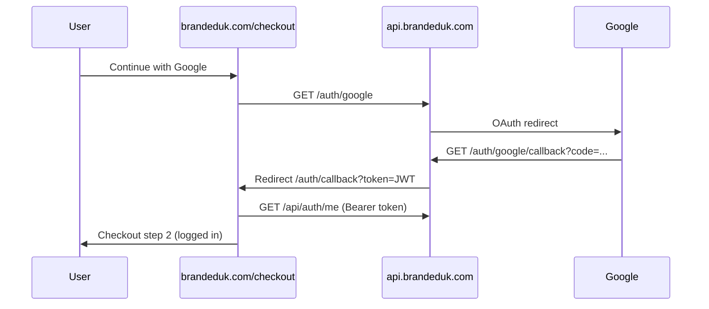

# Google Sign-In – Implementation Plan (BrandedUK)

## Executive summary

**The checkout frontend is already built.** “Continue with Google” fails because the **API backend** does not expose auth routes yet.

| Layer | Repository / URL | Status |
|-------|------------------|--------|
| Frontend (checkout, callback page) | `andyrigoc/brandeduk` → Vercel | Ready |
| API (products, quotes, etc.) | `andyrigoc/Backend-brandeduk` → `https://api.brandeduk.com` | Products OK |
| Google OAuth on API | Same backend | **Not implemented** (`/auth/google` returns **404**) |

**Goal:** Add OAuth + JWT auth to `Backend-brandeduk`, configure Google Cloud, redeploy `api.brandeduk.com`, then verify live checkout.

**Interim:** Customers can use **Continue as Guest** (no Google required).

---

## Current vs target state

### Today

- User clicks **Continue with Google** on checkout.
- Browser goes to `https://api.brandeduk.com/auth/google`.
- API responds **404** (route missing).
- Locally: same flow hits `http://localhost:3004/auth/google` → **connection refused** if the API is not running.

### Target

- `/auth/google` returns **302** → Google sign-in.
- After consent, Google hits `/auth/google/callback` on the API.
- API creates/finds user, issues JWT, redirects to:
  - `https://www.brandeduk.com/auth/callback?token=...&next=/checkout`
- Frontend saves token, calls `/api/auth/me`, continues checkout as logged-in user.

---

## Architecture



| Step | Component | URL / action |
|------|-----------|----------------|
| 1 | Checkout (frontend) | `GET https://api.brandeduk.com/auth/google` |
| 2 | Google | User signs in / consents |
| 3 | API callback | `GET https://api.brandeduk.com/auth/google/callback` |
| 4 | Frontend callback | `https://www.brandeduk.com/auth/callback?token=...` |
| 5 | Frontend | `GET https://api.brandeduk.com/api/auth/me` with `Authorization: Bearer <token>` |

### Frontend files (this repo – no changes required)

| File | Role |
|------|------|
| `checkout.html` | `coStartGoogleAuth()` → redirects to API |
| `auth/callback.html` | Reads `?token=`, stores auth, calls `/api/auth/me`, returns to checkout |
| `vercel.json` | Rewrites `/auth/callback` → `auth/callback.html` |

---

## Phase 1 – Google Cloud Console

**Time:** ~15–20 minutes  
**Owner:** Whoever manages Google Workspace / Cloud for BrandedUK

1. Open [Google Cloud Console](https://console.cloud.google.com/).
2. Create or select a project (e.g. **BrandedUK Production**).
3. **APIs & Services → OAuth consent screen**
   - User type: **External** (or **Internal** if Google Workspace only)
   - App name: **BrandedUK**
   - Support email: your business email
   - Authorized domains: `brandeduk.com`, `api.brandeduk.com`
   - Scopes: `email`, `profile`, `openid`
4. **APIs & Services → Credentials → Create credentials → OAuth client ID**
   - Application type: **Web application**
   - Name: `BrandedUK Checkout`
5. **Authorized JavaScript origins**
   - `https://www.brandeduk.com`
   - `https://brandeduk.com`
   - `http://localhost:5505` (optional – local frontend)
   - `http://127.0.0.1:5505` (optional)
6. **Authorized redirect URIs** (must match the backend exactly)
   - `https://api.brandeduk.com/auth/google/callback` (production)
   - `http://localhost:3004/auth/google/callback` (local API)
7. Save **Client ID** and **Client secret** for Phase 2.

---

## Phase 2 – Backend implementation (`Backend-brandeduk`)

**Repo:** https://github.com/andyrigoc/Backend-brandeduk  
**Local port:** `3004` (matches frontend dev config)  
**Production host:** `https://api.brandeduk.com`

`server.js` today mounts: products, categories, filters, quotes, contact, admin, etc.  
**It does not mount any `/auth` or `/api/auth` routes.**

### 2.1 Install dependencies

```bash
cd Backend-brandeduk
npm install passport passport-google-oauth20 jsonwebtoken bcrypt
```

### 2.2 Environment variables

Set on **Render** (or wherever `api.brandeduk.com` runs) and in local `.env`:

```env
GOOGLE_CLIENT_ID=xxxx.apps.googleusercontent.com
GOOGLE_CLIENT_SECRET=GOCSPX-xxxx

FRONTEND_URL=https://www.brandeduk.com
GOOGLE_CALLBACK_URL=https://api.brandeduk.com/auth/google/callback

JWT_SECRET=use-a-long-random-string-at-least-32-characters

CORS_ORIGIN=https://www.brandeduk.com,https://brandeduk.com

PORT=3004
NODE_ENV=production
```

For local API testing:

```env
GOOGLE_CALLBACK_URL=http://localhost:3004/auth/google/callback
FRONTEND_URL=http://127.0.0.1:5505
```

### 2.3 API routes to add

| Method | Path | Purpose |
|--------|------|---------|
| `GET` | `/auth/google` | Start OAuth; redirect to Google |
| `GET` | `/auth/google/callback` | Receive Google `code`; upsert user; issue JWT; redirect to frontend |
| `POST` | `/api/auth/login` | Email + password login (checkout already calls this) |
| `GET` | `/api/auth/me` | Return current user from `Authorization: Bearer <token>` |

**Redirect after successful Google login** (required shape for the frontend):

```
{FRONTEND_URL}/auth/callback?token={JWT}&next=/checkout
```

Example:

```
https://www.brandeduk.com/auth/callback?token=eyJhbGciOiJIUzI1NiIs...&next=/checkout
```

### 2.4 Database

Use the existing PostgreSQL database. Add a `users` table, for example:

| Column | Notes |
|--------|--------|
| `id` | Primary key |
| `email` | Unique |
| `password_hash` | Nullable (Google-only users) |
| `google_id` | Nullable, unique |
| `first_name`, `last_name` | From Google profile |
| `provider` | `google` or `email` |
| `created_at` | Timestamp |

On Google callback: find user by `google_id` or `email`, or create; then sign JWT.

### 2.5 Wire into `server.js`

```js
const authRoutes = require('./routes/auth');
app.use('/auth', authRoutes);
app.use('/api/auth', authRoutes);
```

Register **before** the global 404 handler.

Suggested new files:

- `routes/auth.js` – Passport Google strategy, login, me, callbacks
- `middleware/auth.js` – JWT verification
- `migrations/00x_users.sql` – `users` table (if not using an ORM migration tool)

---

## Phase 3 – Deploy

1. Commit and push auth changes to `Backend-brandeduk` `main`.
2. Trigger redeploy on **Render** (or current host for `api.brandeduk.com`).
3. Add all env vars from Phase 2.2 in the hosting dashboard.
4. Confirm DNS: `api.brandeduk.com` points to that service.

---

## Phase 4 – Verification

### Quick API checks

| URL | Expected result |
|-----|-----------------|
| `https://api.brandeduk.com/health` | `200`, JSON `healthy` |
| `https://api.brandeduk.com/auth/google` | **302** to `accounts.google.com` (not **404**) |

### End-to-end (production)

1. Open live checkout.
2. Click **Continue with Google**.
3. Complete Google sign-in.
4. Land on `/auth/callback`, then checkout step 2 with user details filled where applicable.

If `/auth/google` is still **404**, auth code is not deployed on production.

---

## Phase 5 – Local development

**Terminal 1 – API**

```bash
git clone https://github.com/andyrigoc/Backend-brandeduk.git
cd Backend-brandeduk
# Create .env (see Phase 2.2, local callback URL)
npm install
npm run dev
```

**Terminal 2 – Frontend** (this repo)

```bash
# Live Server or http-server on port 5505
```

Open `http://127.0.0.1:5505/checkout.html` → **Continue with Google** → should reach `http://localhost:3004/auth/google`.

---

## Implementation checklist

- [ ] Google OAuth client created with correct redirect URIs
- [ ] OAuth consent screen published (or in testing with test users)
- [ ] `GOOGLE_CLIENT_ID` and `GOOGLE_CLIENT_SECRET` set on API host
- [ ] `JWT_SECRET` set on API host
- [ ] `FRONTEND_URL` and `GOOGLE_CALLBACK_URL` set correctly
- [ ] `users` table migrated
- [ ] Routes `/auth/google`, `/auth/google/callback`, `/api/auth/login`, `/api/auth/me` implemented
- [ ] `CORS_ORIGIN` includes `brandeduk.com` / `www.brandeduk.com`
- [ ] Backend redeployed to `api.brandeduk.com`
- [ ] `/auth/google` returns 302 (not 404)
- [ ] Live checkout Google flow tested end-to-end

---

## What customers see until this is done

- **Continue as Guest** – works (no API auth needed).
- **Continue with Google** – shows unavailable message or error until Phase 3–4 are complete.
- **Email login** – only works after `POST /api/auth/login` is implemented and deployed.

---

## Next step

Open **`Backend-brandeduk`** in the IDE and implement Phase 2 (auth routes + DB + env).  
The static frontend repo (`brandeduk`) does not need further changes for Google sign-in.
